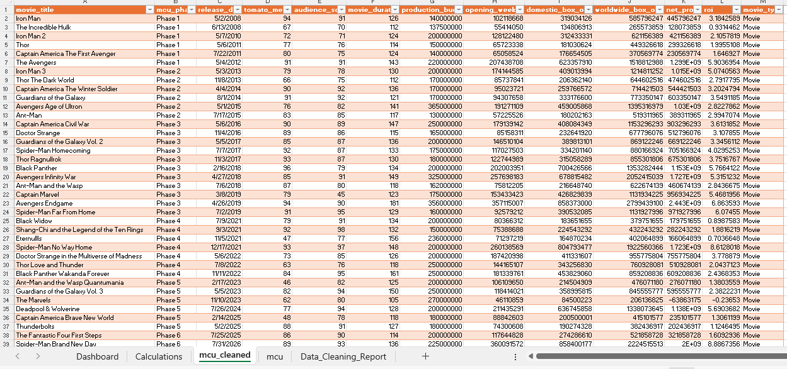
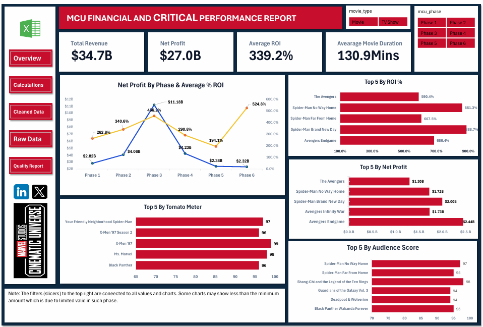

# MCU-Financial-and-Critical-Performance-Report
An executive dashboard analyzing the financial return and critical reception of the Marvel Cinematic Universe. It contrasts production costs against global box office grosses and maps audience versus critic scores to identify the most successful projects across the franchise's phased release strategy.

# Project Overview.
The Marvel Cinematic Universe (MCU) has produced dozens of movies and TV shows across different phases. This project analyzes the financial performance, audience reception, and critic ratings of MCU releases from Phase 1 to Phase 6.

The goal is to understand.
- Which MCU phases performed best financially
- How much profit MCU movies generated
- Which movies had the highest ROI
- How critics and audiences rated MCU releases
- Whether financial performance and audience/critic ratings changed over time

The project was completed using Microsoft Excel, Power Query, PivotTables, and dashboard visualizations.

# Dataset Overview.
The dataset contains 62 MCU releases:
- 38 Movies
- 24 TV Shows
- 6 MCU Phases

Main Data Fields:
- movie_title: Name of the movie or TV show
- mcu_phase: MCU Phase 1–6
- release_date: Release or premiere date
- tomato_meter: Rotten Tomatoes critic score
- audience_score: Rotten Tomatoes audience score
- movie_duration: Movie runtime in minutes
- production_budget: Estimated production cost
- opening_weekend: Domestic opening weekend revenue
- domestic_box_office: Total domestic box office revenue
- worldwide_box_office: Total worldwide box office revenue
- net_profit: Worldwide box office minus production budget
- roi: Return on investment
- movie_type: Movie or TV Show

# Data Cleaning

Before analyzing the data, several cleaning and preparation steps were performed.

Key steps included:

- Converted the dataset into an Excel structured table
- The data was visually analyzed and data issues were spotted and noted.
- I corrected data types and financial formatting for all financial coulumns
- Checked that release dates were properly recognized by excel using the ISNUMBER()
- Further cleaning was done using Power Query
- Cleaned text columns using Power Query by selecting columns then using trim and clean from the format options
- Handled missing values, by changing “NA” cells to “null” to avoid error in power query
- Three helper columns were created to help calculate Net Profit, return on investment and also group the movies with revenue (Movie) from those without revenue (Tv Show) values(movie_type column)

# Calculations

Net Profit = "Worldwide Box Office” - “Production Budget"

ROI = "Net Profit” ÷ “Production Budget"

Note: ROI and profit calculations were only applied to movies because TV shows do not have traditional box-office revenue.»

# Key Results

Overall Performance

Across the 38 MCU movies:

Across the 38 MCU movies:

| Metric | Result |
| :--- | ---: |
| Worldwide Box Office | $34.72B |
| Production Budget | $7.73B |
| Net Profit | $26.99B |
| Average ROI | 3.39x |
| Average Runtime | 130.87 minutes |
| Average Critic Score | 82.63% |
| Average Audience Score | 81.21% |

Performance by MCU Phase
| Phase | Movies | Net Profit | Avg. ROI | Avg. Critic Score | Avg. Audience Score |
| :--- | ---: | ---: | ---: | ---: | ---: |
| Phase 1 | 6 | $2.82B | 2.63x | 80.17% | 79.00% |
| Phase 2 | 6 | $4.06B | 3.41x | 80.83% | 84.00% |
| Phase 3 | 11 | $11.18B | 4.56x | 89.18% | 83.27% |
| Phase 4 | 15 | $4.23B | 2.91x | 83.13% | 84.00% |
| Phase 5 | 17 | $2.38B | 1.94x | 76.18% | 75.29% |
| Phase 6 | 7 | $2.32B | 5.25x | 90.57% | 85.86% |

# Key Findings
Phase 3 had the highest total profit.

It generated approximately $11.18 billion in net profit, making it the strongest phase in terms of total profit.

Phase 5 had the lowest average ROI.

Its average ROI was 1.94x (194%), alongside lower average critic and audience scores.

Phase 6 currently shows a high average ROI and strong ratings, but some Phase 6 data is based on projected or simulated figures. Therefore, these results may change as more releases are completed.

Top 5 Most Profitable Movies
| Movie | Phase | Net Profit | ROI |
| :--- | :--- | ---: | ---: |
| Avengers: Endgame | Phase 3 | $2.44B | 6.86x |
| Spider-Man: Brand New Day | Phase 6 | $2.00B | 8.89x |
| Avengers: Infinity War | Phase 3 | $1.73B | 5.32x |
| Spider-Man: No Way Home | Phase 4 | $1.72B | 8.61x |
| The Avengers | Phase 1 | $1.30B | 5.90x |

Lowest Profit Performers
| Movie | Phase | Net Profit | ROI |
| :--- | :--- | ---: | ---: |
| The Marvels | Phase 5 | -$63.86M | -0.24x |
| The Incredible Hulk | Phase 1 | $128.07M | 0.93x |
| Eternals | Phase 4 | $166.06M | 0.70x |

The Marvels was the only movie in the dataset with a negative net profit.

The Excel dashboard brings the analysis together using:

- KPI cards
- Phase performance comparisons
- Profit and ROI analysis
- Critic vs audience scores
- Movie performance comparisons
- PivotTables and charts

The dashboard is designed to make it easier to identify trends and compare MCU releases.

# Limitations

1. TV Show Financial Data
The 24 TV shows do not have traditional box-office revenue. Because of this, their financial performance could not be compared directly with movies.

2. Marketing Costs
The production budget does not include marketing, advertising, and distribution costs.
Therefore, the calculated profit is not the same as the studio's actual final profit.

# Tools Used
- Microsoft Excel
- Power Query
- PivotTables
- Excel Charts

# Project Goal
This project demonstrates how Excel can be used to take a raw dataset, clean and transform the data, calculate useful business metrics, and turn the results into an easy-to-understand dashboard.

The analysis focuses on financial performance, ROI, audience reception, and critic ratings across the 6 MCU phases data provided.
